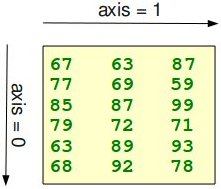
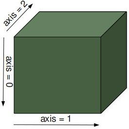
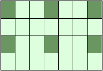
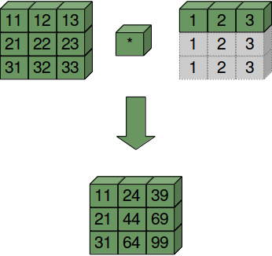
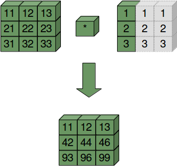

# Numpy array creation
## 创建均匀分布的值
### arange
 * arange([start,] stop[, step,], dtype=None)：生成一个线性增长的某一范围内的数组，和Python中的 range 类似，但是arange支持浮点参数
  - start，stop '[start, stop)';start 默认为0；
  - dtype默认从其他参数推断


```python
import numpy as np
print np.arange(1,10,2)
print np.arange(10.2, 0.8)
print np.arange(10.4)
x = xrange(10)
print x
list(x)
```

    [1 3 5 7 9]
    []
    [  0.   1.   2.   3.   4.   5.   6.   7.   8.   9.  10.]
    xrange(10)


    [0, 1, 2, 3, 4, 5, 6, 7, 8, 9]


x 是一个 generator, 因此不能直接打印

### linspace
 * linspace(start, stop, num=50, endpoint=True, retstep=False)：在闭区间或半开区间中生成等间隔的序列点，即均分区间；
  - start,stop '[start,stop]' 或者 '[start,stop)';
  - num 生成的点数，默认50；
  - endpoint，即[start,stop]为真，[start,stop）为假，就是带不带端点的意思；
  - retstep，为真的时候，会返回额外的间隔，即返回 (samples, step) 二元组；


```python
print np.linspace(1,10)
print np.linspace(1,10,7) #step = (10-1)/(7-1)
print np.linspace(1,10,7,False)
samples, step = np.linspace(1,10,7,True,True)
print samples, step
```

    [  1.           1.18367347   1.36734694   1.55102041   1.73469388
       1.91836735   2.10204082   2.28571429   2.46938776   2.65306122
       2.83673469   3.02040816   3.20408163   3.3877551    3.57142857
       3.75510204   3.93877551   4.12244898   4.30612245   4.48979592
       4.67346939   4.85714286   5.04081633   5.2244898    5.40816327
       5.59183673   5.7755102    5.95918367   6.14285714   6.32653061
       6.51020408   6.69387755   6.87755102   7.06122449   7.24489796
       7.42857143   7.6122449    7.79591837   7.97959184   8.16326531
       8.34693878   8.53061224   8.71428571   8.89795918   9.08163265
       9.26530612   9.44897959   9.63265306   9.81632653  10.        ]
    [  1.    2.5   4.    5.5   7.    8.5  10. ]
    [ 1.          2.28571429  3.57142857  4.85714286  6.14285714  7.42857143
      8.71428571]
    [  1.    2.5   4.    5.5   7.    8.5  10. ] 1.5


## 创建多维数组ndarray
比 Python list 更加高效的多维数组, 接受以 Python list 形式递归嵌套定义的多维数组；
### 0维数组
可以认为是一个标量scalar


```python
x = np.array(777)
print "x: %d" % x
print "type: %s" % type(x)
print "dimension: %d" % np.ndim(x)
print "shape: ", x.shape
```

    x: 777
    type: <type 'numpy.ndarray'>
    dimension: 0
    shape:  ()


### 1维数组


```python
V = np.array([1,2,3,4,5])
print "V: ", V
print "type: ", type(V)
print "dimension: ", np.ndim(V)
print "shape: ", V.shape
```

    V:  [1 2 3 4 5]
    type:  <type 'numpy.ndarray'>
    dimension:  1
    shape:  (5,)


### 多维数组


```python
A = np.array([[1,2,3],
              [4,5,6],
              [7,8,9]])
print A
print A.ndim
print A.shape

Q = np.array([
    [[1,2,3],[4,5,6],[7,8,9]],
    [[10,11,12],[13,14,15],[16,17,18]]
])
print Q
print Q.ndim
print Q.shape
```

    [[1 2 3]
     [4 5 6]
     [7 8 9]]
    2
    (3, 3)
    [[[ 1  2  3]
      [ 4  5  6]
      [ 7  8  9]]
    
     [[10 11 12]
      [13 14 15]
      [16 17 18]]]
    3
    (2, 3, 3)


### ndarray shape 和 axis
多维数组的 shape 就是一个各个维度长度组成的 tuple，每一个维度都有一个轴 axis


```python
x = np.array([ [67, 63, 87],
               [77, 69, 59],
               [85, 87, 99],
               [79, 72, 71],
               [63, 89, 93],
               [68, 92, 78]])
print(np.shape(x))
```

    (6, 3)


二维数组的轴，你可以理解为二维平面坐标轴，axis=0 表示当沿着y方向，axis=1 表示沿着x方向


三维数组的轴，可以理解为三维空间坐标轴，axis=0 表示当沿着y方向，axis=1 表示沿着x方向，axis=2 表示沿着z方向



**高维空间是无法映射到物理空间的，因此也不能画出图像来，但是还是一样，每一个维度对应一个轴，沿着某一个轴，剩下的维度构成一个超空间。**对于2维，沿着x轴，剩下的y维度构成一个直线向下平移；

>多维数组维度的理解，这里如何看出Q是三维且shape为(2,3,3)呢？

**递归定义，递归检查**
 - 先检查第一个中括号对[]里的元素，发现是两个list元素，那么第一维度的长度为2；
 - 进一步进入内部的list [[1,2,3],[4,5,6],[7,8,9]]，递归进行维度检查，发现内部有三个list元素，因此第二维度长度为3；
 - 再进行递归，进入第三层list [1,2,3],此时内部含有三个元素，因此第三维度长度为3；最后再次递归时，发现元素是scalar，停止；

因此是 3 维且 shape 为 (2,3,3)；axis 分别是 0,1,2


```python
def my_shape(l):
    shape = []
    shape.extend([len(l)])
    for e in l:
        if isinstance(e, list):
            shape.extend(my_shape(e))
            break
        else:
            continue
    return shape
l = [
    [[1,2,3],[4,5,6],[7,8,9]],
    [[10,11,12],[13,14,15],[16,17,18]]
]
my_shape(l)
```


    [2, 3, 3]


>维度和axis有什么用呢？

**整形，广播和聚合计算**
 - 我们先来看看聚合计算的例子，就容易知道axis的作用了！


```python
B = np.array([[1,2,3],
              [4,5,6],
              [7,8,9],
              [10,11,12]])
C = np.array([
    [[1,2,3],[4,5,6],[7,8,9]],
    [[10,11,12],[13,14,15],[16,17,18]]
])
print B
print B.shape
print np.sum(B, axis=0)
print np.sum(B, axis=1)
print '-------------------------'
print C
print C.shape
print "axis=0\n", np.sum(C, axis=0)
print "axis=1\n", np.sum(C, axis=1)
print "axis=2\n", np.sum(C, axis=2)

D = np.array([C,C+1,C+2])
print '-------------------------'
print repr(D)
print D.shape
print "axis=0\n", repr(np.sum(D, axis=0))
print "axis=1\n", repr(np.sum(D, axis=1))
print "axis=2\n", repr(np.sum(D, axis=2))
print "axis=3\n", repr(np.sum(D, axis=3))
```

    [[ 1  2  3]
     [ 4  5  6]
     [ 7  8  9]
     [10 11 12]]
    (4, 3)
    [22 26 30]
    [ 6 15 24 33]
    -------------------------
    [[[ 1  2  3]
      [ 4  5  6]
      [ 7  8  9]]
    
     [[10 11 12]
      [13 14 15]
      [16 17 18]]]
    (2, 3, 3)
    axis=0
    [[11 13 15]
     [17 19 21]
     [23 25 27]]
    axis=1
    [[12 15 18]
     [39 42 45]]
    axis=2
    [[ 6 15 24]
     [33 42 51]]
    -------------------------
    array([[[[ 1,  2,  3],
             [ 4,  5,  6],
             [ 7,  8,  9]],
    
            [[10, 11, 12],
             [13, 14, 15],
             [16, 17, 18]]],
    
    
           [[[ 2,  3,  4],
             [ 5,  6,  7],
             [ 8,  9, 10]],
    
            [[11, 12, 13],
             [14, 15, 16],
             [17, 18, 19]]],
    
    
           [[[ 3,  4,  5],
             [ 6,  7,  8],
             [ 9, 10, 11]],
    
            [[12, 13, 14],
             [15, 16, 17],
             [18, 19, 20]]]])
    (3, 2, 3, 3)
    axis=0
    array([[[ 6,  9, 12],
            [15, 18, 21],
            [24, 27, 30]],
    
           [[33, 36, 39],
            [42, 45, 48],
            [51, 54, 57]]])
    axis=1
    array([[[11, 13, 15],
            [17, 19, 21],
            [23, 25, 27]],
    
           [[13, 15, 17],
            [19, 21, 23],
            [25, 27, 29]],
    
           [[15, 17, 19],
            [21, 23, 25],
            [27, 29, 31]]])
    axis=2
    array([[[12, 15, 18],
            [39, 42, 45]],
    
           [[15, 18, 21],
            [42, 45, 48]],
    
           [[18, 21, 24],
            [45, 48, 51]]])
    axis=3
    array([[[ 6, 15, 24],
            [33, 42, 51]],
    
           [[ 9, 18, 27],
            [36, 45, 54]],
    
           [[12, 21, 30],
            [39, 48, 57]]])


> 以上聚合计算，axis如何改变 np.sum 的最终结果呢？

 * 坐标空间法
   - 根据坐标平面来理解，利用空间想象，axis=0就是沿着y轴移动，即每一条垂直于x轴的线，累加起来，reduce成为一个sum点，得到 [22 26 30]的结果；反之，axis=1就是沿着x轴移动，即每一条垂直与y轴的线，累加起来，reduce成为一个sum点，得到 [ 6 15 24 33]；
   - 利用空间只能想象到三维，因此不太通用，并不是聚合计算中采用axis的本质；
 * **抽象维度法**（我也称之为降维攻击法 ^<^）
   - 更加通用的方法，其实 axis 的本质，采用抽象的方法来理解，更容易计算出最终结果；以上面的C为例:
   - axis=0，即把该维度进行降维，根据sum将该维度reduce成一个点。具体操作就是定位第0维度，即递归的第一层次，该维度长度为2，剩下维度构成一个超空间，第0维度的每一个元素都对应着一个超空间，即第一个list元素[[1,2,3],[4,5,6],[7,8,9]]超空间，第二个list元素[[10,11,12],[13,14,15],[16,17,18]]超空间，沿着第0维度将这些超空间的元素对应位置累加起来，最后reduce掉第0维度，即结果成为shape（3,3）的一个超空间（在这里就是一个平面）[[11,13,15],[17,19,21],[23,25,27]];
   - axis=1,即把第1维度进行降维，首先定位，即第二次递归，进入第二层次的那个维度，这个维度有第0维度的第一个元素中的三个list元素[1,2,3],[4,5,6],[7,8,9]以及第0维度的第二个元素中的三个list元素[10,11,12],[13,14,15],[16,17,18]，此时对其进行reduce降维，将三个元素累加起来，得到shape为(2,3)的超空间[[12,15,18],[39,42,45]],即在不改变另外两个维度的前提下，缩减axis维度。
   - axis=2，即把递归进入第三层，该维度有三个scalar元素，即子空间[0][0]的[1,2,3],[0][1]的[4,5,6],[0][2]的[7,8,9],[1][0]的[10,11,12], [1][1]的[13,14,15], [1][2]的[16,17,18]，将三个scalar直接相加起来，[[6,15,24],[33,42,51]]
   - 抽象维度法的步骤就是，**定位维度所在递归列表的层次，不改变另外两个维度的前提下，将所有处于该维度的元素reduce降维；**
   
>D的axis=1的例子？

定位到第二个`[`,内部两个元素，因为该维度长度2，
\begin{equation}
 \begin{bmatrix}
   1  &  2  &  3 \\
   4  &  5  &  6 \\
   7  &  8  &  9
 \end{bmatrix},
 \begin{bmatrix}
   10 & 11 & 12 \\
   13 & 14 & 15 \\
   16 & 17 & 18
 \end{bmatrix}
\end{equation}

将该维度降维，即
\begin{equation}
 \begin{bmatrix}
   1 & 2 & 3 \\
   4 & 5 & 6 \\
   7 & 8 & 9
  \end{bmatrix}+
 \begin{bmatrix}
   10 & 11 & 12 \\
   13 & 14 & 15 \\
   16 & 17 & 18
  \end{bmatrix}=
 \begin{bmatrix}
   11 & 13 & 15 \\
   17 & 19 & 21 \\
   23 & 25 & 27
  \end{bmatrix}
\end{equation}


### 索引和切片（indexing & slicing）
索引和 Python list tuple 一样的用法，可以采用 list[i][j][k]的写法或者 list[i,j,k]，并且还支持 tuple 索引，即索引是一个数组，直接取出一批数据；


```python
python_list = [1,2,3,4,5,6]
python_slice = python_list[1:4]
print python_list
print python_slice
python_slice[0] = 777
print python_slice
print python_list

X = np.arange(28)
print(X)
X = X.reshape(4,7)
print X
print X[1,1]
array_index_x = X[(0,1,2),(4,5,6)]
print array_index_x
array_index_x[0] = 999
print array_index_x
print X
```

    [1, 2, 3, 4, 5, 6]
    [2, 3, 4]
    [777, 3, 4]
    [1, 2, 3, 4, 5, 6]
    [ 0  1  2  3  4  5  6  7  8  9 10 11 12 13 14 15 16 17 18 19 20 21 22 23 24
     25 26 27]
    [[ 0  1  2  3  4  5  6]
     [ 7  8  9 10 11 12 13]
     [14 15 16 17 18 19 20]
     [21 22 23 24 25 26 27]]
    8
    [ 4 12 20]
    [999  12  20]
    [[ 0  1  2  3  4  5  6]
     [ 7  8  9 10 11 12 13]
     [14 15 16 17 18 19 20]
     [21 22 23 24 25 26 27]]


切片和 Python list tuple 也类似，但是有一点不同：** Python list 和 tuple 中切片会创建一个新的对象，改变这个对象不影响原来的 list，但是 numpy 中的 ndarray，切片创建的是原来 ndarray 的视图，修改后会改变原始 ndarray；但是通过数组索引的形式获取的，就不是视图了，而是新的对象。**
 - X[start:stop:step], [start, stop)左闭右开




```python
X = np.arange(28)
print(X)
print X[::-1]
X = np.reshape(X,(4,7))
print X
view = X[::2, ::3]
print(view)
view[0][0] = 777
print X
view = X[1:-1, 1:-1]
print view
view = X[::-1, ::-1]
print view
```

    [ 0  1  2  3  4  5  6  7  8  9 10 11 12 13 14 15 16 17 18 19 20 21 22 23 24
     25 26 27]
    [27 26 25 24 23 22 21 20 19 18 17 16 15 14 13 12 11 10  9  8  7  6  5  4  3
      2  1  0]
    [[ 0  1  2  3  4  5  6]
     [ 7  8  9 10 11 12 13]
     [14 15 16 17 18 19 20]
     [21 22 23 24 25 26 27]]
    [[ 0  3  6]
     [14 17 20]]
    [[777   1   2   3   4   5   6]
     [  7   8   9  10  11  12  13]
     [ 14  15  16  17  18  19  20]
     [ 21  22  23  24  25  26  27]]
    [[ 8  9 10 11 12]
     [15 16 17 18 19]]
    [[ 27  26  25  24  23  22  21]
     [ 20  19  18  17  16  15  14]
     [ 13  12  11  10   9   8   7]
     [  6   5   4   3   2   1 777]]


### 内存共享
我们可以使用 `np.may_share_memory(A, B)` 来查看两个array是否共享了内存；如果A B 内存有共享的部分，就返回真；


```python
np.may_share_memory(X, view)
```


    True


`ndarray.data` 用来得到array的数组数据的指针地址，我们会发现**通过 reshape 存在某种内存共享；**


```python
A = np.arange(12)
B = A.reshape(3,4)
print repr(A.data)
print repr(B.data)
print (A.data == B.data)
print np.may_share_memory(A,B)
A[7] = 777
print A
print B
#print (view.data) #AttributeError: cannot get single-segment buffer for discontiguous array
```

    <read-write buffer for 0x7fc0ac2c14e0, size 96, offset 0 at 0x7fc0ac327eb0>
    <read-write buffer for 0x7fc0ac2c1080, size 96, offset 0 at 0x7fc0ac327f30>
    True
    True
    [  0   1   2   3   4   5   6 777   8   9  10  11]
    [[  0   1   2   3]
     [  4   5   6 777]
     [  8   9  10  11]]


## 创建特殊array & 数组copy
创建特殊的ndarray的方法，numpy 提供了很多[api](https://docs.scipy.org/doc/numpy/reference/routines.array-creation.html)来创建特殊的ndarray；ones & zeros & eye & identity


```python
zeros = np.zeros((4,4))
ones = np.ones((3,3))
identity = np.identity(4)
eye = np.eye(4,5, k=1)
print zeros
print ones
print identity
print eye
copy = ones.copy()
print copy
```

    [[ 0.  0.  0.  0.]
     [ 0.  0.  0.  0.]
     [ 0.  0.  0.  0.]
     [ 0.  0.  0.  0.]]
    [[ 1.  1.  1.]
     [ 1.  1.  1.]
     [ 1.  1.  1.]]
    [[ 1.  0.  0.  0.]
     [ 0.  1.  0.  0.]
     [ 0.  0.  1.  0.]
     [ 0.  0.  0.  1.]]
    [[ 0.  1.  0.  0.  0.]
     [ 0.  0.  1.  0.  0.]
     [ 0.  0.  0.  1.  0.]
     [ 0.  0.  0.  0.  1.]]
    [[ 1.  1.  1.]
     [ 1.  1.  1.]
     [ 1.  1.  1.]]


# Numpy data type
## dtype
>假如要使用numpy装入一个二维的下列表格，表中的每一列数据类型都不一样，如何做呢？

|Country | Population Density| Area  | Population|
|:-------|:-----------|:-------|:------|:-----------|
|Netherlands|	393	| 41526	| 16,928,800 |
|Belgium	|   337	| 30510	| 11,007,020 |
|United Kingdom	|256|243610	| 62,262,000 |
|Germany	|233	|357021	| 81,799,600 |
|Liechtenstein|	205	|160	| 32,842     |
|Italy	    |192	|301230	| 59,715,625 |
|Switzerland|	177	|41290	|7,301,994|
|Luxembourg	|173	|2586	|512,000|
|France	|111	|547030	|63,601,002|
|Austria	|97	|83858	|8,169,929|
|Greece	|81	|131940	|11,606,813|
|Ireland	|65	|70280	|4,581,269|
|Sweden	|20	|449964	|9,515,744|
|Finland|16	|338424	|5,410,233|
|Norway	|13	|385252	|5,033,675|


```python
dt = np.dtype([('density', np.int32)])
x = np.array([(393,), (337,), (256,)],
             dtype=dt)
print(x)
print("\nThe internal representation:")
print(repr(x))
print x['density']
```

    [(393,) (337,) (256,)]
    
    The internal representation:
    array([(393,), (337,), (256,)], 
          dtype=[('density', '<i4')])
    [393 337 256]


我们可以采用 `np.dtype` 给某一列定义一个数据类型对象，这个对象可以通过复杂的组合，生成一个结构化的数据类型，就像结构体一样；对于 density 这一列，是 int32 数据类型。目前只有这一列，因此x 的构造写法是按列的写法；np.int32 的 内部表示其实是 `<i4`；`<>=`表示大端小端法和本地；


```python
dt = np.dtype('<d') 
print(dt.name, dt.byteorder, dt.itemsize)
dt = np.dtype('>d')  
print(dt.name, dt.byteorder, dt.itemsize)
dt = np.dtype('d') 
print(dt.name, dt.byteorder, dt.itemsize)
```

    ('float64', '=', 8)
    ('float64', '>', 8)
    ('float64', '=', 8)


以上分别表示 8 字节的浮点类型，小端（即本地的），大端和本地的；
下面创建的就是一个结构体类型对象，每一个tuple对应一列；


```python
dt = np.dtype([('country', 'S20'), ('density', 'i4'), ('area', 'i4'), ('population', 'i4')])
x = np.array([('Netherlands', 393, 41526, 16928800),
('Belgium', 337, 30510, 11007020),
('United Kingdom', 256, 243610, 62262000),
('Germany', 233, 357021, 81799600),
('Liechtenstein', 205, 160, 32842),
('Italy', 192, 301230, 59715625),
('Switzerland', 177, 41290, 7301994),
('Luxembourg', 173, 2586, 512000),
('France', 111, 547030, 63601002),
('Austria', 97, 83858, 8169929),
('Greece', 81, 131940, 11606813),
('Ireland', 65, 70280, 4581269),
('Sweden', 20, 449964, 9515744),
('Finland', 16, 338424, 5410233),
('Norway', 13, 385252, 5033675)],
             dtype=dt)
print(x[:4])
```

    [('Netherlands', 393, 41526, 16928800) ('Belgium', 337, 30510, 11007020)
     ('United Kingdom', 256, 243610, 62262000)
     ('Germany', 233, 357021, 81799600)]


```python
print(x['density'])
print(x['country'])
print(x['area'][2:5])
```

    [393 337 256 233 205 192 177 173 111  97  81  65  20  16  13]
    ['Netherlands' 'Belgium' 'United Kingdom' 'Germany' 'Liechtenstein' 'Italy'
     'Switzerland' 'Luxembourg' 'France' 'Austria' 'Greece' 'Ireland' 'Sweden'
     'Finland' 'Norway']
    [243610 357021    160]


下面是一个嵌套定义的结构类型，每一行记录有两个大类型，time 和 temperature， time又是一个结构类型，分别由 h min sec 构成；


```python
time_type = np.dtype([('time', [('h', int), ('min', int), ('sec', int)]),('temperature', float)])
times = np.array( [((11, 42, 17), 20.8), ((13, 19, 3), 23.2) ], dtype=time_type)
print(times)
print(times['time'])
print(times['time']['h'])
print(times['temperature'])
```

    [((11, 42, 17), 20.8) ((13, 19, 3), 23.2)]
    [(11, 42, 17) (13, 19, 3)]
    [11 13]
    [ 20.8  23.2]


小结：
 - **类型可以嵌套定义组合**
 - **确定一个表的最终类型时，可以看每一列是什么数据类型，然后每一列是一个二元tuple，即(fieldname, datatype),然后组合np.dtype([(f1,d1),(f2,d2),...(fn,dn)]);**
 - **分解子datatype，如果dn不是基本datatype，则可以继续分解递归定义；**

# Numpy numerical operations
## Arithmetic Operations with two Arrays
对应位置元素 做某种操作运算


```python
A = np.array([ [11, 12, 13], [21, 22, 23], [31, 32, 33] ])
B = np.ones((3,3))
print("Adding to arrays: ")
print(A + B)
print("\nMultiplying two arrays: ")
print(A * (B + 1))
```

    Adding to arrays: 
    [[ 12.  13.  14.]
     [ 22.  23.  24.]
     [ 32.  33.  34.]]
    
    Multiplying two arrays: 
    [[ 22.  24.  26.]
     [ 42.  44.  46.]
     [ 62.  64.  66.]]


## Matrix Multiplication
矩阵运算，点积dot product

 - dot(a, b, out=None)
   - 对于 2-D arrays, 点积运算等价于矩阵运算；对于 1-D arrays, 点积等价于内积 inner product即向量积；对于 N 维数组，点积是 `a` 的最后一个axis 和 `b` 的 倒数第二个axis 的和积；**和积: 2-D 里就是'a'的每一个行向量和'b'的每一个列向量做 inner product**
   - 如果 'a' 的 最后一维长度 和 'b' 的倒数第二维长度不一样，抛出 ValueError； 例如， a.shape[-1] != b.shape[-2]

### 二维上的dot


```python
A = np.array([ [1, 2, 3], 
               [3, 2, 1] ])
B = np.array([ [2, 3, 4, -2], 
               [1, -1, 2, 3],
               [1, 2, 3, 0] ])

print(A.shape[-1] == B.shape[-2], A.shape[1]) 
print(np.dot(A, B))
```

    (True, 3)
    [[ 7  7 17  4]
     [ 9  9 19  0]]


### 三维上的dot


```python
X = np.array(
    [[[3, 1, 2],
      [4, 2, 2]],
     [[-1, 0, 1],
      [1, -1, -2]],
     
     [[3, 2, 2],
      [4, 4, 3]],
     [[2, 2, 1],
      [3, 1, 3]]])
Y = np.array(
    [[[2, 3, 1, 2, 1],
      [2, 2, 2, 0, 0],
      [3, 4, 0, 1, -1]],
     [[1, 4, 3, 2, 2],
      [4, 1, 1, 4, -3],
      [4, 1, 0, 3, 0]]])
R = np.dot(X, Y)
print("X.shape: ", X.shape, "   X.ndim: ", X.ndim)
print("Y.shape: ", Y.shape, "   Y.ndim: ", Y.ndim)
print("R.shape: ",     R.shape, "R.ndim: ", R.ndim)
print("\nThe result array R:\n")
print(R)
```

    ('X.shape: ', (4, 2, 3), '   X.ndim: ', 3)
    ('Y.shape: ', (2, 3, 5), '   Y.ndim: ', 3)
    ('R.shape: ', (4, 2, 2, 5), 'R.ndim: ', 4)
    
    The result array R:
    
    [[[[ 14  19   5   8   1]
       [ 15  15  10  16   3]]
    
      [[ 18  24   8  10   2]
       [ 20  20  14  22   2]]]
    
    
     [[[  1   1  -1  -1  -2]
       [  3  -3  -3   1  -2]]
    
      [[ -6  -7  -1   0   3]
       [-11   1   2  -8   5]]]
    
    
     [[[ 16  21   7   8   1]
       [ 19  16  11  20   0]]
    
      [[ 25  32  12  11   1]
       [ 32  23  16  33  -4]]]
    
    
     [[[ 11  14   6   5   1]
       [ 14  11   8  15  -2]]
    
      [[ 17  23   5   9   0]
       [ 19  16  10  19   3]]]]


按照 dot 对 n 维的定义，
 - 3 维应该是 X.shape[2] 和 Y.shape[1] 做 sum product；他们在各自维度上长度都是 3；该维度会被吞并成为一个scalar，最后结果为 shape 为 `(X.shape[0], X.shape[1], Y.shape[0], Y.shape[2])` 的array； 
 - **如果是 n 维度的， 那么最后结果就是 `(X.shape[0], X.shape[1],..., X.shape[-2], Y.shape[0],..., Y.shape[-1])`**

以 R[0] 为例，它是 R 的 axis = 0 维度的第一个元素， 那么该元素列表应该是由剩余的维度做 sum product得到；

\begin{equation*}
 \begin{bmatrix}
   3 & 1 & 2
 \end{bmatrix}
 \begin{bmatrix}
  2 \\
  2 \\
  3
 \end{bmatrix}
 =
 14
\end{equation*}


```python
# 这里由于第一个维度 固定是第0个元素，因此 i = 0；不进行循环；
i = 0
for j in range(X.shape[1]):
    for k in range(Y.shape[0]):
        for m in range(Y.shape[2]):
            fmt = "    sum(X[{}, {}, :] * Y[{}, :, {}]) :  {}"
            arguments = (i, j, k, m, sum(X[i, j, :] * Y[k, :, m]))
            print(fmt.format(*arguments))
            
print R[0]
```

        sum(X[0, 0, :] * Y[0, :, 0]) :  14
        sum(X[0, 0, :] * Y[0, :, 1]) :  19
        sum(X[0, 0, :] * Y[0, :, 2]) :  5
        sum(X[0, 0, :] * Y[0, :, 3]) :  8
        sum(X[0, 0, :] * Y[0, :, 4]) :  1
        sum(X[0, 0, :] * Y[1, :, 0]) :  15
        sum(X[0, 0, :] * Y[1, :, 1]) :  15
        sum(X[0, 0, :] * Y[1, :, 2]) :  10
        sum(X[0, 0, :] * Y[1, :, 3]) :  16
        sum(X[0, 0, :] * Y[1, :, 4]) :  3
        sum(X[0, 1, :] * Y[0, :, 0]) :  18
        sum(X[0, 1, :] * Y[0, :, 1]) :  24
        sum(X[0, 1, :] * Y[0, :, 2]) :  8
        sum(X[0, 1, :] * Y[0, :, 3]) :  10
        sum(X[0, 1, :] * Y[0, :, 4]) :  2
        sum(X[0, 1, :] * Y[1, :, 0]) :  20
        sum(X[0, 1, :] * Y[1, :, 1]) :  20
        sum(X[0, 1, :] * Y[1, :, 2]) :  14
        sum(X[0, 1, :] * Y[1, :, 3]) :  22
        sum(X[0, 1, :] * Y[1, :, 4]) :  2
    [[[14 19  5  8  1]
      [15 15 10 16  3]]
    
     [[18 24  8 10  2]
      [20 20 14 22  2]]]


```python
R2 = np.zeros(R.shape, dtype=np.int)
for i in range(X.shape[0]):
    for j in range(X.shape[1]):
        for k in range(Y.shape[0]):
            for m in range(Y.shape[2]):
                R2[i, j, k, m] = np.dot(X[i, j, :],Y[k, :, m])
print( np.array_equal(R, R2) )
```

    True


以上就是三维 dot 的内部工作机制，**其实就是简单的循环累加，弄清楚我们需要做 sum product 的是哪一个维度，因为这个维度会被合并降维成一个scalar，剩下的维度做循环即可。**

## Comparison Operators
numpy中的 比较运算符返回的并不是 Python 中的 一个单一的 True 或 False, 而是一个array，里面每一个元素都是bool，是element-wise比较；因为 Python 中 True == 1 False == 0; 因此
 - 求两个array对应位置相等元素的位置索引
   - A[np.nonzero(A==B)]
 - 求两个array对应元素相等的个数，使用 
   - len(np.flatnonzero(A==B))
 - 求相同元素百分比：
   - np.mean(A==B)
 


```python
A = np.array([ [11, 12, 13], [21, 22, 23], [31, 32, 33] ])
B = np.array([ [11, 102, 13], [201, 22, 203], [31, 32, 303] ])
common = A == B
print common
print A[np.nonzero(A==B)]
print len(np.flatnonzero(common))
print np.mean(A==B)
```

    [[ True False  True]
     [False  True False]
     [ True  True False]]
    [11 13 22 31 32]
    5
    0.555555555556


## Broadcasting
广播是numpy很重要的一个功能，这里介绍在numpy array shape 里面提到的与shape 和 axis有关的广播；


```python
B = np.array([[1,2,3]] * 3)
print B.shape
B
```

    (3, 3)


    array([[1, 2, 3],
           [1, 2, 3],
           [1, 2, 3]])


注意以上并不是广播，这是Python自带的循环重复元素的写法；我们先介绍一个升维的方法，np.newaxis。


```python
A = np.array([ [11, 12, 13], [21, 22, 23], [31, 32, 33], [41, 42, 43] ])
print repr(A)
print A.shape
A1 = A[np.newaxis,:,:]
A2 = A[:,np.newaxis,:]
A3 = A[:,:,np.newaxis]
print repr(A1)
print A1.shape
print repr(A2)
print A2.shape
print repr(A3)
print A3.shape

AA = A[np.newaxis, :, :, np.newaxis]
print repr(AA)
print AA.shape
```

    array([[11, 12, 13],
           [21, 22, 23],
           [31, 32, 33],
           [41, 42, 43]])
    (4, 3)
    array([[[11, 12, 13],
            [21, 22, 23],
            [31, 32, 33],
            [41, 42, 43]]])
    (1, 4, 3)
    array([[[11, 12, 13]],
    
           [[21, 22, 23]],
    
           [[31, 32, 33]],
    
           [[41, 42, 43]]])
    (4, 1, 3)
    array([[[11],
            [12],
            [13]],
    
           [[21],
            [22],
            [23]],
    
           [[31],
            [32],
            [33]],
    
           [[41],
            [42],
            [43]]])
    (4, 3, 1)
    array([[[[11],
             [12],
             [13]],
    
            [[21],
             [22],
             [23]],
    
            [[31],
             [32],
             [33]],
    
            [[41],
             [42],
             [43]]]])
    (1, 4, 3, 1)


可以看出，**np.newaxis 就是增加一个维度，并且增加的维度与其插入的位置有关，插入到第几个位置，就成为第几个维度，原始的维度值保持不变；**

>np.newaxis是如何改变原始array的呢？

**递归列表未完待续**
 - 目前有一种tricks，就是看插入位置的[]加在哪里。新轴在第2个维度，那么就给原本第1个维度的每一个元素加个[],新轴在第三维度，就在原本第2个维度的每一个元素加个[]

### 广播进行的方向


```python
B = np.array([1, 2, 3])
print B.shape
B1 = B[:, np.newaxis]
B1[0] = 7
print B
print repr(B1)
B1[0] = 1
A * B[:, np.newaxis]
```

    (3,)
    [7 2 3]
    array([[7],
           [2],
           [3]])


    ---------------------------------------------------------------------------

    ValueError                                Traceback (most recent call last)

    <ipython-input-35-d31486c531b6> in <module>()
          6 print repr(B1)
          7 B1[0] = 1
    ----> 8 A * B[:, np.newaxis]
    

    ValueError: operands could not be broadcast together with shapes (4,3) (3,1) 





```python
A = np.array([10, 20, 30])
B = np.array([1, 2, 3])
print repr(A[:, np.newaxis])
print repr(A[:, np.newaxis] * B)
```



以下是实现以上操作的另外两种实现，显式的使用了 concatenate 和 tile 方法升维；


```python
A = np.array([ [11, 12, 13], [21, 22, 23], [31, 32, 33] ])
B = np.array([1, 2, 3])
B = B[np.newaxis, :]
B = np.concatenate((B, B, B))
print("Multiplication: ")
print(A * B)
print("... and now addition again: ")
print(A + B)

A = np.array([ [11, 12, 13], [21, 22, 23], [31, 32, 33] ])
B = np.tile(np.array([1, 2, 3]), (3, 1))
print(B)
print("Multiplication: ")
print(A * B)
print("... and now addition again: ")
print(A + B)
```

### 三维空间broadcasting


```python
A = np.array([ [[3, 4, 7], [5, 0, -1] , [2, 1, 5]],
      [[1, 0, -1], [8, 2, 4], [5, 2, 1]],
      [[2, 1, 3], [1, 9, 4], [5, -2, 4]]])
B = np.array([ [[3, 4, 7], [1, 0, -1], [1, 2, 3]] ])
B * A

B = np.array([1, 2, 3])
B = B[np.newaxis, :]
print(B.shape)
B = np.concatenate((B, B, B)).transpose()
print(B.shape)
B = B[:, np.newaxis]
print(B.shape)
print(B)
print(A * B)
```

    (1, 3)
    (3, 3)
    (3, 1, 3)
    [[[1 1 1]]
    
     [[2 2 2]]
    
     [[3 3 3]]]
    [[[ 3  4  7]
      [ 5  0 -1]
      [ 2  1  5]]
    
     [[ 2  0 -2]
      [16  4  8]
      [10  4  2]]
    
     [[ 6  3  9]
      [ 3 27 12]
      [15 -6 12]]]


小结：
>Broadcasting provides a means of vectorizing array operations so that looping occurs in C instead of Python. It does this without making needless copies of data and usually leads to efficient algorithm implementations. There are, however, cases where broadcasting is a bad idea because it leads to inefficient use of memory that slows computation.

广播是numpy提供的向量化数组的操作，能够使得循环发生在 C 代码级别，而不是在 Python 级别，从而提高执行速度，但这种加速是有限制的，如果数组过于庞大，会进行大量的复制操作，反而会减慢计算速度，从而更加低效；[numpy broadcasting efficiency](http://scipy.github.io/old-wiki/pages/EricsBroadcastingDoc)

广播规则：
 1. **如果两个 array 的 rank 即 len(shape) 不同，那么给较低的array的 shape 在前面加上(prepend) 1 从而升维，直到低维array的shape和高维array的shape长度一样，即len(x.shape) == len(y.shape)；** 例如 x.shape = (1,2,3) y.shape = (3,) 则 y.shape = (1,1,3)
 2. **两个数组某个维度上兼容`compatible`,就是该维度长度要么相等，要么其中之一是1；**
 3. **只有所有维度`compatible`数组才能进行合法自动广播；**
 4. **广播之后，每一个数组，在每一个维度上就变成相同的了，且等于较大者；**
 5. **在某个维度上长度为1的数组会进行广播，就是沿着这个维度复制剩余维度的元素，使得该维度长度变长到两个数组中较大者；**
 

# Numpy changing dimensions
## flatten
多维数组退化成一维
 - flatten()
 - ravel()


```python
A = np.array([[[ 0,  1],
               [ 2,  3],
               [ 4,  5],
               [ 6,  7]],
              [[ 8,  9],
               [10, 11],
               [12, 13],
               [14, 15]],
              [[16, 17],
               [18, 19],
               [20, 21],
               [22, 23]]])
Flattened_X = A.flatten()
print(Flattened_X)
print(A.flatten(order="C"))
print(A.flatten(order="F"))
print(A.flatten(order="A"))
```

    [ 0  1  2  3  4  5  6  7  8  9 10 11 12 13 14 15 16 17 18 19 20 21 22 23]
    [ 0  1  2  3  4  5  6  7  8  9 10 11 12 13 14 15 16 17 18 19 20 21 22 23]
    [ 0  8 16  2 10 18  4 12 20  6 14 22  1  9 17  3 11 19  5 13 21  7 15 23]
    [ 0  1  2  3  4  5  6  7  8  9 10 11 12 13 14 15 16 17 18 19 20 21 22 23]


## reshape
整形，总数不变的情况下生成另一个shape的array
 - reshape(a, newshape, order='C')
   - order	'C', 'F', 'A', 代表展开顺序，C-style 首维最慢，尾维最快，F-style 按列展开，首维最快，尾维最慢
   - ‘C’ means to read / write the elements using C-like index order, with the last axis index changing fastest, back to the first axis index changing slowest. 
   - ‘F’ means to read / write the elements using Fortran-like index order, with the first index changing fastest, and the last index changing slowest.
   - read/write就表示，读取原来的数组，按照order方式，然后生成新shape的数组，也按order方式写入；


```python
X = np.array(range(24))
Y = X.reshape((3,4,2))
print repr(Y)
Z = Y.reshape((4,3,2),order='F')
print repr(Z)
```

    array([[[ 0,  1],
            [ 2,  3],
            [ 4,  5],
            [ 6,  7]],
    
           [[ 8,  9],
            [10, 11],
            [12, 13],
            [14, 15]],
    
           [[16, 17],
            [18, 19],
            [20, 21],
            [22, 23]]])
    array([[[ 0,  1],
            [10, 11],
            [20, 21]],
    
           [[ 8,  9],
            [18, 19],
            [ 6,  7]],
    
           [[16, 17],
            [ 4,  5],
            [14, 15]],
    
           [[ 2,  3],
            [12, 13],
            [22, 23]]])


整形的真实过程其实像如下代码一样，最后验证我们的判断是正确的，即**先按照 order 读取原数组为一个一维的数组，然后再将一维数组中的元素按照 order 写入新shape的array中；**


```python
# F style read
temp = []
for i in range(Y.shape[2]):
    for j in range(Y.shape[1]):
        for k in range(Y.shape[0]):
            temp.append(Y[k, j, i])
print temp

# F style write
newshape = (4,3,2)
result = np.zeros(newshape, dtype=np.int32)
for i in range(newshape[2]):
    for j in range(newshape[1]):
        for k in range(newshape[0]):
            result[k, j, i] = temp[i * newshape[1] * newshape[0] + j * newshape[0] + k]
print result == Z
    
```

    [0, 8, 16, 2, 10, 18, 4, 12, 20, 6, 14, 22, 1, 9, 17, 3, 11, 19, 5, 13, 21, 7, 15, 23]
    [[[ True  True]
      [ True  True]
      [ True  True]]
    
     [[ True  True]
      [ True  True]
      [ True  True]]
    
     [[ True  True]
      [ True  True]
      [ True  True]]
    
     [[ True  True]
      [ True  True]
      [ True  True]]]


## Concatenating Arrays
numpy.concatenate((a1, a2, ...), axis=0)
 - axis : int, optional
   The axis along which the arrays will be joined. Default is 0.

沿着axis进行连接，使得该维度的元素成为一组；

### 对一维数组的连接


```python
A = np.array([7,77,777])
B = np.array([3,1,2])
C = np.concatenate((A,B))
print A,B,C
```

    [  7  77 777] [3 1 2] [  7  77 777   3   1   2]


### 对二维数组的连接


```python
x = np.array(range(24))
x = x.reshape((3,4,2))
y = np.array(range(100,124))
y = y.reshape((3,4,2))
z = np.concatenate((x,y))
print(z)
```

    [[[  0   1]
      [  2   3]
      [  4   5]
      [  6   7]]
    
     [[  8   9]
      [ 10  11]
      [ 12  13]
      [ 14  15]]
    
     [[ 16  17]
      [ 18  19]
      [ 20  21]
      [ 22  23]]
    
     [[100 101]
      [102 103]
      [104 105]
      [106 107]]
    
     [[108 109]
      [110 111]
      [112 113]
      [114 115]]
    
     [[116 117]
      [118 119]
      [120 121]
      [122 123]]]


```python
z = np.concatenate((x,y),axis = 1)
print(z)
```

    [[[  0   1]
      [  2   3]
      [  4   5]
      [  6   7]
      [100 101]
      [102 103]
      [104 105]
      [106 107]]
    
     [[  8   9]
      [ 10  11]
      [ 12  13]
      [ 14  15]
      [108 109]
      [110 111]
      [112 113]
      [114 115]]
    
     [[ 16  17]
      [ 18  19]
      [ 20  21]
      [ 22  23]
      [116 117]
      [118 119]
      [120 121]
      [122 123]]]


**万变不离其宗，与 axis 和 shape 有关的操作，都是递归确定在哪一个维度上进行，然后就是合并，降维，sum product等等;**这里就是合并；第二个维度即第二个括号里面的元素，同级的第二个括号里面的元素重新合并在一起了。

## Adding New Dimensions


```python
x = np.array([2,5,18,14,4])
y = x[:, np.newaxis]
print(y)
```

    [[ 2]
     [ 5]
     [18]
     [14]
     [ 4]]


## Vector Stacking


```python
A = np.array([3, 4, 5])
B = np.array([1,9,0])
print(np.row_stack((A, B)))
print(np.column_stack((A, B)))
np.shape(A)

```

    [[3 4 5]
     [1 9 0]]
    [[3 1]
     [4 9]
     [5 0]]


    (3,)


```python
A = np.array([[3, 4, 5],
              [1, 9, 0],
              [4, 6, 8]])
print repr(np.column_stack((A, A, A)))
print repr(np.column_stack((A[0], A[0], A[0])))
print repr(np.dstack((A, A, A)))
```

    array([[3, 4, 5, 3, 4, 5, 3, 4, 5],
           [1, 9, 0, 1, 9, 0, 1, 9, 0],
           [4, 6, 8, 4, 6, 8, 4, 6, 8]])
    array([[3, 3, 3],
           [4, 4, 4],
           [5, 5, 5]])
    array([[[3, 3, 3],
            [4, 4, 4],
            [5, 5, 5]],
    
           [[1, 1, 1],
            [9, 9, 9],
            [0, 0, 0]],
    
           [[4, 4, 4],
            [6, 6, 6],
            [8, 8, 8]]])


## Repeating Patterns, The "tile" Method


```python
import numpy as np
x = np.array([ [1, 2], [3, 4]])
print np.tile(x, (3,4))
x = np.array([[1, 2], [3, 4]])
print(np.tile(x, 2))
```

    [[1 2 1 2 1 2 1 2]
     [3 4 3 4 3 4 3 4]
     [1 2 1 2 1 2 1 2]
     [3 4 3 4 3 4 3 4]
     [1 2 1 2 1 2 1 2]
     [3 4 3 4 3 4 3 4]]
    [[1 2 1 2]
     [3 4 3 4]]

